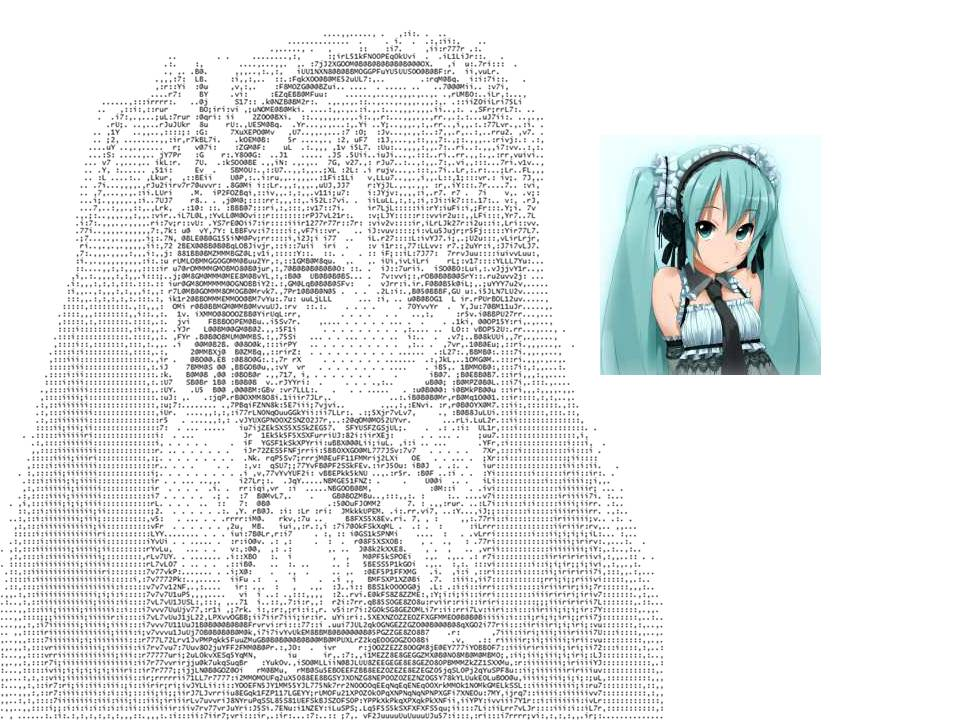
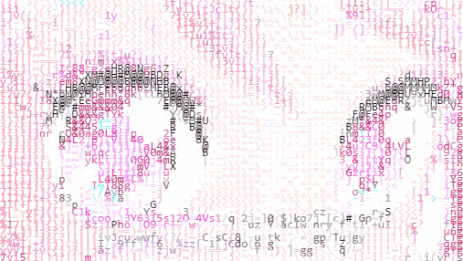

# Terminal-Mosaic 🎬🎨

Terminal-Mosaic is a high-performance Python application that transforms standard images and video clips into high-definition ASCII character mosaics. It offers real-time ANSI color streaming inside your command-line interface alongside high-resolution file exports with preserved audio tracks.

---

## 📋 Table of Contents
1. [About the Project](#-about-the-project)
2. [Project Architecture](#-project-architecture)
3. [How the Media Pipeline Works](#-how-the-media-pipeline-works)
4. [Prerequisites & System Setup](#-prerequisites--system-setup)
5. [Installation & Virtual Environment](#-installation--virtual-environment)
6. [Running on Your Local Machine](#-running-on-your-local-machine)
7. [Real-time Processing & File Exports](#-real-time-processing--file-exports)
8. [Output Gallery & Results](#-output-gallery--results)

---

## 📄 About the Project

`Terminal-Mosaic` processes visual media by evaluating pixel luminance and TrueColor RGB vectors.

* **Luminance Character Mapping:** Translates pixel brightness into dense character layers (`$@B%8&WM#*oahkbdpqwmZO0QLCJUYXzcvunxrft/\|()1{}[]?-_+~<>i!lI;:,"^'`. `).
* **Dual Output Stream Engine:** Streams full-color ANSI text frames live to your terminal at 30 FPS while rendering pixel-perfect HD outputs (`.png` / `.mp4`).
* **Synchronized Audio Preservation:** Uses `ffmpeg` to extract source audio and `pygame` to synchronize sound with live terminal playback and final MP4 file encoding.

---

## 🏗️ Project Architecture

```text
                     +-----------------------+
                     |   Input File Source   |
                     | (Image / MP4 Video)   |
                     +-----------+-----------+
                                 |
                                 v
                     +-----------------------+
                     |    main.py (CLI)      |
                     +-----------+-----------+
                                 |
                                 v
                     +-----------------------+
                     | process_frame() Engine|
                     |  - Brightness Map     |
                     |  - RGB TrueColor      |
                     |  - 9:16 Mobile Crop   |
                     +----+-------------+----+
                          |             |
           +--------------+             +--------------+
           |                                           |
           v                                           v
+-----------------------+                   +-----------------------+
|  Terminal Live Stream |                   | HD Canvas File Stream |
|  - ANSI Escape Codes  |                   |  - PIL Image Drawing  |
|  - Realtime Audio Sync|                   |  - OpenCV MP4 Writer  |
+-----------------------+                   +-----------+-----------+
                                                        |
                                                        v
                                            +-----------------------+
                                            |  FFmpeg Audio Muxer   |
                                            |  - AAC Audio Merge    |
                                            +-----------+-----------+
                                                        |
                                                        v
                                            +-----------------------+
                                            |  Final Output Files   |
                                            | (PNG / Audio MP4)     |
                                            +-----------------------+

```
## ⚙️ How the Media Pipeline Works

1. **`process_frame()`** (`src/mosaic_generator.py`):
   - Accepts an uncompressed OpenCV image array (`np.ndarray`).
   - Applies an automatic 9:16 vertical mobile aspect ratio crop if requested (`is_mobile_ratio=True`).
   - Resizes pixel resolution based on `scale_factor`.
   - Extracts grayscale brightness maps for ASCII character selection and RGB true-colors for cell coloring.
   - Outputs an ANSI-encoded string for console streaming and draws a high-resolution PIL image canvas.

2. **`generate_ascii_mosaic()`**:
   - Reads an input image using OpenCV (`cv2.imread`).
   - Renders the terminal preview and outputs a high-resolution PNG image file.

3. **`generate_ascii_video()`**:
   - Extracts the source audio track to a temporary WAV buffer (`temp_audio.wav`) via `ffmpeg`.
   - Plays audio live through `pygame.mixer` while rendering terminal frames at 30 FPS.
   - Clears terminal output in place (`\033[H`) to eliminate screen flickering.
   - Encodes high-res ASCII frames into a silent MP4 buffer before merging the audio track back into the file.

---

## 🛠️ Prerequisites & System Setup

Ensure the following prerequisites are installed before setting up the application:

* **Python:** Version 3.10 or higher
* **Git:** For cloning the repository
* **FFmpeg:** System binary required for video audio extraction and muxing
  * **Windows:** Run `winget install ffmpeg` or download from [ffmpeg.org](https://ffmpeg.org/) and add `ffmpeg/bin` to your System Environment Variables (PATH).
  * **macOS:** Run `brew install ffmpeg`
  * **Linux (Ubuntu/Debian):** Run `sudo apt update && sudo apt install ffmpeg`

---

## 🐍 Installation & Virtual Environment

Follow these commands step-by-step to set up your environment:

### 1. Clone the Repository
```bash
git clone [https://github.com/your-username/terminal-mosaic.git](https://github.com/your-username/terminal-mosaic.git)
cd terminal-mosaic

```
### 2. Set Up a Virtual Environment

* **Windows (Command Prompt / PowerShell):**
  ```cmd
  python -m venv venv
  venv\Scripts\activate

``
  ### macOS / Linux

```bash
python3 -m venv venv
source venv/bin/activate

```
## 3. Install Python Dependencies

Install the required Python packages:

```bash
pip install opencv-python numpy pillow pygame

```
## Optional: Freeze Dependencies

To save the installed dependencies into a `requirements.txt` file:

```bash
pip freeze > requirements.txt

```
<h2>💻 Running on Your Local Machine</h2>

<p>
  Make sure your virtual environment is activated before running the CLI commands.
</p>

<h3>Option A: Generate ASCII Image</h3>

<pre><code>python main.py image assets/sample_image.jpg</code></pre>

<p><strong>Terminal Output:</strong></p>

<p>Renders colored ASCII art directly in your console.</p>

<p><strong>Saved File:</strong></p>

<p>Exports the generated high-resolution ASCII mosaic to:</p>

<pre><code>assets/output_mosaic.png</code></pre>

<hr>

<h3>Option B: Generate ASCII Video</h3>

<pre><code>python main.py video assets/sample_video.mp4</code></pre>

<p><strong>Terminal Output:</strong></p>

<p>
  Streams video frames at <strong>30 FPS</strong> with synchronized live audio playback.
</p>

<p><strong>Saved File:</strong></p>

<p>
  Exports the final <strong>9:16 mobile-format ASCII video</strong>
  with the complete audio track to:
</p>

<pre><code>assets/output_mosaic_video.mp4</code></pre>

<hr>

<h2>⚡ Real-time Processing &amp; File Exports</h2>

<ul>
  <li>
    <strong>In-Memory Frame Processing:</strong>
    Video frames are processed sequentially in memory using OpenCV array
    operations, reducing unnecessary disk I/O and memory usage.
  </li>

  <li>
    <strong>Real-time Terminal Rendering:</strong>
    ASCII video frames are rendered directly in the terminal while the
    video is being processed.
  </li>

  <li>
    <strong>Audio Synchronization:</strong>
    Audio playback is synchronized with the real-time ASCII video stream.
  </li>

  <li>
    <strong>Direct Output Export:</strong>
    Generated PNG images and MP4 videos are automatically saved to the
    <code>assets/</code> directory.
  </li>

  <li>
    <strong>Automatic Cleanup:</strong>
    Temporary files such as <code>temp_audio.wav</code> and
    <code>temp_silent_output.mp4</code> are automatically removed after
    processing.
  </li>
</ul>
<br>
<p align="center">
  
</p>

<hr>

<h2>🖼️ Output Gallery &amp; Results</h2>

<h3>1. Generated ASCII Image Preview</h3>

<p>
  When converting a static image, <code>terminal-mosaic</code> maps image
  intensity and color information onto ASCII character cells and renders
  the result on a clean terminal canvas.
</p>

<pre>
$$$$$$$$$$$$$$$$$$$$$$$$$$$$$$$$$$$$$$$$$$$$$$$$$$$$$$$$$$$$$$$$$$$$$$$$$$$$$$$$$$$$$$$$$$$$$$
$$$$$$$$$$$$$$$$$$$$$$$$$$$$$$$$$$$$$$$$$$$$$$$$$$$$$$$$$$$$$$$$$$$$$$$$$$$$$$$$$$$$$$$$$$$$$$
$$$$$$$$$$$$$$$$$$$$$$$$$$$$$$$$$$$$$$$$$$$$$$$$$$$$$$$$$$$$$$$$$$$$$$$$$$$$$$$$$$$$$$$$$$$$$$
$$$$$$$$$$$$$$$$$$$$$$$$$$$$$$$$$$$$$$$$$$$$$$$$$$$$$$$$$$$$$$$$$$$$$$$$$$$$$$$$$$$$$$$$$$$$$$
$$$$$$$$$$$$$$$$$$$$$$$$$$$$$$$$$$$$$$$$$$$$$$$$$$$$$$$$$$$$$$$$$$$$$$$$$$$$$$$$$$$$$$$$$$$$$$
$$$$$$$$$$$$$$$$$$$$$$$$$$$$$$$$$$$$$$$$$$$$$$$$$$$$$$$$$$$$$$$$$$$$$$$$$$$$$$$$$$$$$$$$$$$$$$
$$$$$$$$$$$$$$$$$$$$$$$$$$$$$$$$$$$$$$$$$$$$$$$$$$$$$$$$$$$$$$$$$$$$$$$$$$$$$$$$$$$$$$$$$$$$$$
</pre>

<p><strong>Saved Output:</strong></p>

<pre><code>assets/output_mosaic.png</code></pre>
<table align="center">
  <tr>
    <td align="center">
      
      <br>
      <strong>ASCII Picture Preview </strong>
    </td>
    <td align="center">
      
      <br>
      <strong>ASCII Image</strong>
    </td>
  </tr>
</table>

<hr>

<h3>2. Generated ASCII Video Preview </h3>

<p>
  The video processor converts each frame into ASCII characters and
  streams the result directly to the terminal.
</p>

<pre>
======================= LIVE TERMINAL ASCII VIDEO STREAM =======================

[ Stream Rate: 30 FPS | Audio Track: Active | Aspect Ratio: 9:16 Mobile ]

$$$$$$$$$$$$$$$$$$$$$$$$$$$$$$$$$$$$$$$$$$$$$$$$$$$$$$$$$$$$$$$$$$$$$$$$$$$$$$$$
$$$$$$$$$$$$$$$$$$$$$$$$$$$$$$$$$$$$$$$$$$$$$$$$$$$$$$$$$$$$$$$$$$$$$$$$$$$$$$$$
$$$$$$$$$$$$$$$$$$$$$$$$$$$$$$$$$$$$$$$$$$$$$$$$$$$$$$$$$$$$$$$$$$$$$$$$$$$$$$$$
$$$$$$$$$$$$$$$$$$$$$$$$$$$$$$$$$$$$$$$$$$$$$$$$$$$$$$$$$$$$$$$$$$$$$$$$$$$$$$$$
$$$$$$$$$$$$$$$$$$$$$$$$$$$$$$$$$$$$$$$$$$$$$$$$$$$$$$$$$$$$$$$$$$$$$$$$$$$$$$$$

================================================================================
</pre>

<p><strong>Saved Output:</strong></p>

<pre><code>assets/output_mosaic_video.mp4</code></pre>
<table align="center">
  <tr>
    <td align="center">
      
      <br>
      <strong>ASCII Video Preview</strong>
    </td>
    <td align="center">
      
      <br>
      <strong>ASCII Image</strong>
    </td>
  </tr>
</table>

<blockquote>
  🎵 The exported video does not includes the complete AAC audio track we have to add it on by solving some dependencies.
</blockquote>

<hr>

<h3 align="center">🎨 terminal-mosaic</h3>

<p align="center">
  <strong>Real-Time ASCII Image & Video Mosaic Generator</strong>
</p>

<p align="center">
  
</p>

<p align="center">
  <em>✨ Watch an image transform into ASCII art, character by character.</em>
</p>

<p align="center">
  
  
  
  
  
</p>

<p align="center">
  <a href="https://github.com/BlockNotes-4515/ASCII-Terminal-Mosaic-ART">
    
  </a>

  <a href="https://github.com/BlockNotes-4515/ASCII-Terminal-Mosaic-ART/network/members">
    
  </a>

  <a href="https://github.com/BlockNotes-4515/ASCII-Terminal-Mosaic-ART/issues">
    
  </a>

  <a href="https://github.com/BlockNotes-4515/ASCII-Terminal-Mosaic-ART">
    
  </a>
</p>

<p align="center">
  <strong>⚡ Image → ASCII → Video</strong>
</p>

<p align="center">
  Built with ❤️ using Python 🐍
</p>

<p align="center">
  ⭐ If you enjoyed the project, consider giving it a star!
</p>

<p align="center">
  <sub>© 2026 terminal-mosaic • Open Source Project</sub>
</p>
